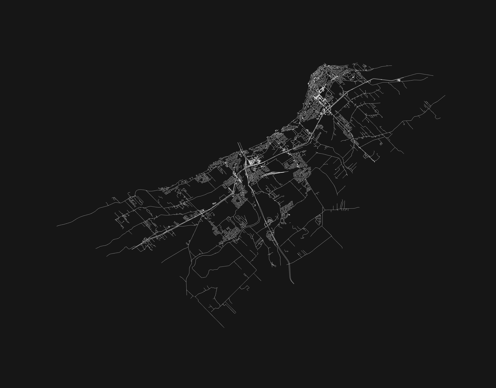

This post is about a web app I built using Antigravity and Gemini. 
But this post is also about why every developer should embrace AI-assisted development now more than ever.

A few years back I came across this repo: https://github.com/anvaka/city-roads
I was immediately intrigued by both the design and the simplicity: just some API calls and some minimalistic design choices.

Immediately I had the idea of building a web app -– a GeoGuessr-like experience but with a similar minimalist aesthetic.
I could've done it but learning front-end development was not something I was interested in at the time.

Fast forward a few years and Antigravity and Gemini are here.
Generous token limits, a decent foundation on how to build things, and a few hours of work and we get this:

> https://cities.panch.io

Yes this was basically vibe-coded. I understand that there are mixed feelings about AI-assisted development. 
I wouldn't necessarily recommend deploying an vibe-coded app that handles sensitive data (yet). 
But I *would* recommend using these tools to unlock areas of the development process that were previously inaccessible.

I understand now how the [one-person unicorn](https://techcrunch.com/2025/02/01/ai-agents-could-birth-the-first-one-person-unicorn-but-at-what-societal-cost) will be built. AI agents.

Go build something.