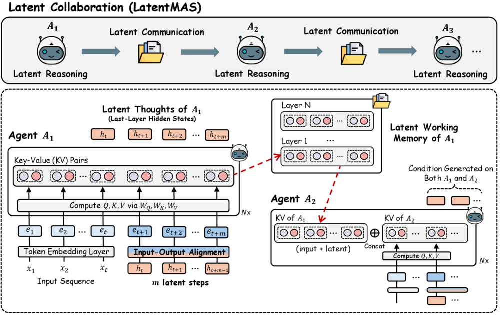

# Model Language Beyond Tokens

Recent discussions around *model language* have highlighted the growing gap between the representations used internally by large models and the symbolic forms exposed to users. While much of this discourse remains conceptual, recent work on latent communication in multi-agent systems makes this distinction operational.

The paper  
*Latent Communication in Multi-Agent Systems*  
(Zou et al., 2025) [[link](https://arxiv.org/abs/2511.20639)] proposes a multi-agent architecture in which agents exchange information exclusively through latent representations rather than natural language tokens. This design choice is motivated by efficiency and expressivity, and empirical results suggest meaningful gains along those axes.

At the same time, the approach raises foundational questions about observability, traceability, and the role of language as an interface between human oversight and machine coordination. These questions are not incidental; they follow directly from removing language as the medium of interaction.

---

# Latent Communication and the Limits of Human Legibility

A useful cultural reference point is the film *Her* (2013), in which artificial assistants progressively abandon human language in favor of faster, private modes of communication. The relevance of the analogy is not emotional but structural: once coordination no longer occurs in a shared symbolic medium, external observers lose direct access to intermediate reasoning processes.

LatentMAS represents an instance of this shift in a concrete technical setting. The system does not merely compress language; it bypasses it. As a result, standard tools for inspecting agent behavior — dialog logs, message attribution, stepwise reasoning traces — are no longer available by construction.

This does not imply incorrectness or misalignment. It does, however, mark a departure from assumptions that underlie much of current work on interpretability in multi-agent systems, which typically presumes language-mediated interaction as a source of transparency.

---

# LatentMAS Explained

In LatentMAS, each agent operates as a large language model but communicates by passing internal hidden states — specifically, layer-wise representations and key–value (KV) caches — directly to downstream agents. Intermediate agents do not decode these representations into text; only the final agent produces a natural-language output.

This design yields several immediate consequences:

- Communication bandwidth between agents is significantly higher than token-based exchange  
- Information loss from repeated encoding and decoding is reduced  
- Inference becomes faster due to reduced token generation  

Importantly, these gains are achieved without additional training. The architecture exploits existing model representations rather than modifying the underlying models themselves.

From a systems perspective, LatentMAS reframes multi-agent coordination as a problem of *representation sharing* rather than *message passing*.  
The latent space effectively becomes a communication protocol.

---

# Transparency and Traceability in the Era of Model Language

The primary consequence of latent communication is not reduced correctness, but reduced observability.

In text-based multi-agent systems, reasoning is externalized as a byproduct of communication. Even if explanations are imperfect, the structure of interaction is accessible: which agent proposed which hypothesis, how disagreements were resolved, and where information entered the system.

Latent communication removes this scaffolding. Observers are left with access to inputs and outputs, but not to intermediate interactions. Attribution of influence becomes ill-defined, and standard notions of traceability do not directly apply.

This creates a distinct class of interpretability challenges:

- How should we define *steps* in a system where coordination occurs in continuous spaces?
- What does it mean to audit or debug a failure when the interaction itself is not symbolically represented?
- Which properties of agent interaction are essential to recover, and which can be abstracted away?

These are not merely tooling issues; they suggest a need to rethink interpretability for systems where interaction occurs in latent space rather than being explicit.

---

# Research Directions: Toward Interpretable Latent Collaboration

Rather than treating latent communication as inherently opaque, it is more productive to ask what forms of partial observability are feasible and sufficient. Several research directions follow naturally.

## 1. Latent-to-Text Decoding

One approach is to learn mappings from latent interaction trajectories to human-interpretable descriptions.

Given access to latent states, task context, and final outputs, a separate model could be trained to produce structured summaries or rationales corresponding to internal coordination.

Key research questions include:

- What semantic information is recoverable from latent exchanges?
- Are there stable, task-independent patterns in latent communication?
- How faithful must a decoding be to support debugging, auditing, or analysis?

This reframes interpretability as a supervised inference problem over interaction representations, rather than as direct inspection of reasoning traces.

## 2. Architectures with Enforced Trace Points

A complementary direction is architectural.

Instead of fully unconstrained latent exchange, systems could be designed with periodic projection into interpretable or constrained subspaces.

Examples include:

- Mandatory intermediate summaries at fixed depths    
- Bottlenecks aligned with known semantic dimensions  
- Hybrid systems where latent exchange is interleaved with minimal symbolic checkpoints  

This approach treats traceability as a design constraint rather than a post-hoc analysis problem.

## 3. Monitoring and Meta-Reasoning Agents

A third direction is to decouple task performance from oversight.

Dedicated monitoring agents could observe latent exchanges and reason about properties of the interaction without participating in task solving.

Such agents might assess:

- Degree of agreement or divergence among agents  
- Sensitivity of conclusions to specific latent inputs  
- Structural properties of coordination (e.g., dominance, convergence, collapse)  

This shifts interpretability from reconstructing internal content to analyzing interaction dynamics.

---

# Closing Remarks

Latent communication in multi-agent systems is likely to become more common as efficiency and performance pressures increase. The contribution of LatentMAS is not only empirical but conceptual: it demonstrates that language is not a necessary medium for coordination among language models.

The corresponding research challenge is to develop frameworks for understanding, monitoring, and analyzing systems whose internal interactions are not naturally human-readable. Addressing this challenge will require new abstractions, new evaluation metrics, and potentially new architectural constraints.

There is substantial open research space at the intersection of representation learning, multi-agent systems, and interpretability.
