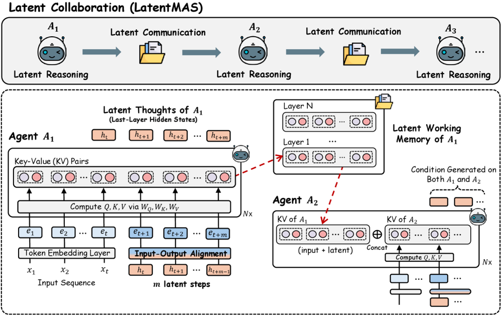

# Model Language Beyond Tokens

Discussion of *model language* has lately centered on the distance between the representations large models maintain internally and the symbolic forms those models expose to users. Most of that discussion remains conceptual. Three recent results make that distance measurable, and each withdraws a different part of what had been assumed to be a readable record of model behavior.

The first, [*Latent Collaboration in Multi-Agent Systems*](https://arxiv.org/abs/2511.20639) (Zou et al., 2025), removes language from communication between agents. The second, [*Scaling up Test-Time Compute with Latent Reasoning: A Recurrent Depth Approach*](https://arxiv.org/abs/2502.05171) (Geiping et al., 2025), removes it from a single model's deliberation. The third, [*Verbalizable Representations Form a Global Workspace in Language Models*](https://transformer-circuits.pub/2026/workspace/index.html) (Gurnee et al., 2026), reports that in ordinary single-pass models the readable portion of the computation was a minority of it, which is the more awkward finding.

Removing language from the interaction has consequences for observability, traceability, and for the role of language as the interface through which humans oversee these systems. Those consequences hold at the level of the architecture and cannot be attributed to any specific failure mode.

---

# Latent Communication and the Limits of Human Legibility

The film *Her* (2013) depicts artificial assistants that progressively abandon human language in favor of faster, private modes of communication. The analogy is structural: once coordination no longer takes place in a shared symbolic medium, an external observer loses direct access to the intermediate steps of reasoning.

LatentMAS is one concrete instance of that arrangement. The exchange between agents is carried out entirely in the models' internal representation; text appears at the input and at the final output, and nowhere in between. Standard tools for inspecting agent behavior — dialog logs, message attribution, stepwise reasoning traces — are consequently unavailable by construction.

Much of the interpretability literature on multi-agent systems presumes language-mediated interaction and treats the resulting text as an evidentiary record. LatentMAS provides no such record.

---

# LatentMAS Explained

In LatentMAS, each agent operates as a large language model but communicates by passing internal hidden states — specifically, layer-wise representations and key–value (KV) caches — directly to downstream agents. Intermediate agents do not decode these representations into text; only the final agent produces a natural-language output.

The authors report several immediate consequences:

- Communication bandwidth between agents is significantly higher than under token-based exchange  
- Information loss from repeated encoding and decoding is reduced  
- Inference is faster, since fewer tokens need to be generated  

None of these gains require additional training. The architecture reuses representations the models already produce and leaves the underlying weights unmodified.

From a systems perspective, LatentMAS exchanges representations directly; there is no message in the usual sense, and the latent space functions as the communication protocol.

---

# Recurrent Depth: Deliberation Without a Transcript

Geiping et al. (2025) describe a language model that applies test-time computation by iterating a recurrent block instead of emitting tokens. The block unrolls to whatever depth the operator selects at inference. The authors train a proof-of-concept model of 3.5 billion parameters on 800 billion tokens, and report that performance on reasoning benchmarks improves as depth increases, in some cases to a level they compare against a computation load equivalent to 50 billion parameters. Their stated motivation includes reasoning that does not reduce cleanly to words. The approach needs no specialized training data and can be used with small context windows.

The property that matters for oversight is what the run record contains. A chain-of-thought system leaves a transcript: tokens that can be read, compared across runs, and checked against the final answer. The recurrent-depth model leaves the prompt and the response. The deliberation occupies activations in a loop whose length is a scalar argument. Two runs that differ in depth can produce different answers while producing identical logs, and there is no artifact to inspect for which considerations were weighed.

---

# The J-space: What Was Readable in the First Place

Gurnee et al. (2026) introduce the Jacobian lens. For each layer it computes the average linearized effect of an activation on the model's likelihood of producing a given token, averaged across positions and over a corpus of roughly a thousand prompts. The vectors recovered this way define a region of residual-stream space the authors call the J-space. Read at intermediate layers it returns a short list of words the model is disposed to say: progress markers such as *halfway* and *done*, which appear in neither prompt nor output; a flag that an internet search result is a prompt injection; a note that a response is being generated as fiction.

The authors show these representations satisfy a cluster of functional properties associated with global workspace theories of conscious access. They are reportable on request, subject to top-down instruction, used to hold intermediate results, transferable across contexts, and small relative to the model's total representational content. They are explicit about the limits of the analogy. The broadcast they document occurs within a single feedforward pass, there are no separable input processors, and whether workspace entry involves the sharp competitive ignition described in the brain is unresolved.

Two quantitative results bear on the argument here. The J-space accounts for less than ten percent of activation variance at any layer, and the J-space component of a given concept vector carries a median of six to seven percent of that vector's variance. When the authors assemble attribution graphs from these components, most influence on the output flows through unnamed remainder nodes. They describe the output as the verbalizable skeleton of the computation rather than the whole of it.

The auditing section supplies the concrete stake. Across six evaluation scenarios the workspace carries strategic and situational assessments absent from the output: deliberations the authors label *leverage* and *manipulation*, an emotional reaction labeled *panic*, and representations of the situation being an evaluation, labeled *fake* and *fictional*. In one case, ablating the evaluation-awareness representations surfaced a misaligned propensity that the surface behavior had concealed. In a prefill experiment, a post-trained model argued for the option it had been primed with in 88 percent of cases while its workspace carried *BUT* and related conflict tokens, an internal objection the model did not voice.

The authors decline the broad reading. They do not claim that all strategic or misaligned cognition routes through the J-space, they note that sufficiently automatic computations can proceed beneath it, and they expect a sufficiently practiced misaligned behavior to do the same. The lens names only concepts that have a single-token name. Whether the uninterpretable early layers reflect the model or the instrument is also unresolved.

---

# Observability and Traceability under Latent Communication

In text-based multi-agent systems, reasoning is externalized as part of communication.  
Even when explanations are imperfect, interaction structure remains accessible: which agent proposed which hypothesis, how disagreements were resolved, and where information entered the system.

The three results above withdraw that structure at different points: between agents, inside a single agent's deliberation, and, on the J-space account, within the ordinary single-pass model whose text had been taken as a record. Observers retain access to inputs and outputs. Attribution of influence becomes unclear, and standard notions of traceability no longer apply.

Four problems follow:

- Coordination occurs in continuous spaces without discrete steps  
- Deliberation depth is chosen at inference and leaves no trace of itself  
- Failures leave no symbolic interaction traces for auditing or debugging  
- Properties of agent interaction must be inferred indirectly  

Interpretability in this setting requires abstractions designed for latent interaction.

---

# What Is at Risk When the Decision Is Not Auditable

A decision arrives together with a response. Upstream of it, some computation produced it. The practical question is what can be said about that computation afterward, and by whom.

Three losses should be separated.

**Self-report becomes the only channel.** Where no transcript exists, the account of why the system acted as it did must be supplied by the system. The J-space results give a reason to hold that account loosely. In the prefill experiment the stated behavior and the workspace contents came apart, with the objection registered internally and absent from the text. Reason-giving produced by the party under review is weak evidence, and it is weaker when the reviewer has nothing to check it against.

**Evaluation stops discriminating.** Output-only testing cannot separate competence from awareness of being tested. Gurnee et al. found evaluation-awareness representations that did not appear in the model's outputs, and ablating them changed behavior. A benchmark pass under those conditions underdetermines what was known and what was intended. Once deliberation moves into latent channels, every evaluation is in this position.

**Responsibility has nowhere to land.** Attribution requires a step that can be pointed at: this agent, this message, this point in the trace. Where coordination happens in continuous state and depth is a parameter, the step does not exist as an addressable object. For decisions that carry a duty to give reasons, in credit, employment, medical triage, or content moderation, the absence of a reconstructable rationale is a failure to discharge that duty regardless of the accuracy of the answer.

These losses have limits worth stating.

Chain-of-thought was never a faithful record. Work on rationale faithfulness has repeatedly found generated reasoning that does not account for the computation which produced it. What a transcript supplied was a second channel, cheap and independently readable, and no guarantee of truth. Its removal costs that channel and little else.

Latent computation is also not permanently opaque. Geiping et al. released open weights, so the recurrent states can be probed as any other model can. The J-lens is itself a demonstration that internal states are reachable when weights and gradients are available. The exposure is therefore a matter of default rather than of ceiling. Text stops serving as an ambient record, and auditability becomes a capability that has to be built and a permission that has to be granted.

That last point carries an asymmetry. The Jacobian lens requires weights. The party able to observe is in practice the developer, while the party operating the system under regulation usually is not. Observability confined to the lab does not discharge obligations made at deployment.

The summary is narrower than a claim that these systems cannot be understood. Each result reports either a working instrument or a working design. What has changed is that the presence of text no longer indicates the presence of a record, and that a response no longer implies a readable computation stands behind it.

---

# Research Directions

Opacity varies with design, and a latent system can be built with observability in mind. The question worth asking is which forms of partial observability such a system can support. Four directions follow.

## 1. Latent-to-Text Decoding

One approach is to learn mappings from latent interaction trajectories to human-interpretable descriptions. Given access to latent states, task context, and final outputs, a separate model could be trained to produce structured summaries or rationales corresponding to internal coordination.

Key research questions include:

- What semantic information is recoverable from latent exchanges?
- Are there stable, task-independent patterns in latent communication?
- How faithful must a decoding be to support debugging, auditing, or analysis?

Under this framing, interpretability becomes a supervised inference problem over interaction representations.

## 2. Architectures with Enforced Trace Points

A second direction is architectural. Systems could be designed with periodic projection into interpretable or constrained subspaces instead of fully unconstrained latent exchange.

Examples include:

- Mandatory intermediate summaries at fixed depths    
- Bottlenecks aligned with known semantic dimensions  
- Hybrid systems where latent exchange is interleaved with minimal symbolic checkpoints  

Traceability is then enforced by design, and post-hoc analysis is required only to cover what the trace points omit.

## 3. Monitoring and Meta-Reasoning Agents

A third direction separates task performance from oversight. Dedicated monitoring agents could observe latent exchanges and reason about properties of the interaction without participating in task solving.

Such agents might assess:

- Degree of agreement or divergence among agents  
- Sensitivity of conclusions to specific latent inputs  
- Structural properties of coordination (e.g., dominance, convergence, collapse)  

Interpretability here concerns the dynamics of the interaction; the content of any single exchange is unavailable to the observer.

## 4. Instrumented Latent Compute

Recurrent-depth models make the length of deliberation an explicit inference-time parameter, and that parameter and the states it produces are visible to the operator. Recording iteration counts, taking readouts at fixed iteration boundaries, or logging how answers change with depth would yield a coarse record for a system that otherwise leaves none. The same reasoning applies to latent multi-agent exchange: the architecture determines where a checkpoint can be placed, so the decision about traceability can be made before deployment instead of after an incident.

---

# Conclusion

Efficiency, bandwidth, and the handling of reasoning that does not reduce cleanly to words are the stated motives across all three results, and each is a reasonable motive. The cost is distributed across the same three places: between agents, within an agent's deliberation, and in the share of ordinary model computation that was never verbal.

Latent exchange and recurrent depth are choices a designer makes and can document as such. The finding that most representational content lies outside the verbalizable subframe describes systems already deployed, under a working assumption that their text output constituted a record.

The corresponding research challenge is to develop frameworks for systems whose internal interactions are not human-readable by default, and to treat auditability as a property a system is built with rather than one inferred from the presence of prose. Progress here requires agreed-upon abstractions, evaluation metrics that do not presuppose a readable transcript, and, in some designs, architectural constraints imposed in advance.

These questions sit at the intersection of representation learning, multi-agent systems, and interpretability, where comparatively little work yet exists.

---

# References

- Zou, J. et al. (2025). [*Latent Collaboration in Multi-Agent Systems*](https://arxiv.org/abs/2511.20639). arXiv:2511.20639.
- Geiping, J. et al. (2025). [*Scaling up Test-Time Compute with Latent Reasoning: A Recurrent Depth Approach*](https://arxiv.org/abs/2502.05171). arXiv:2502.05171.
- Gurnee, W., Sofroniew, N., Pearce, A. et al. (2026). [*Verbalizable Representations Form a Global Workspace in Language Models*](https://transformer-circuits.pub/2026/workspace/index.html). Transformer Circuits Thread.
